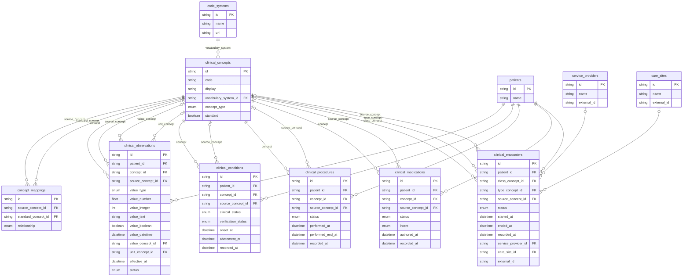

# Schema



---

# Sample Queries

Run raw SQL query joining patient, observations, and concepts

```sql
SELECT
    p.name                          AS patient,
    obs_c.code                      AS concept_code,
    obs_c.display                   AS concept_display,
    cs.name                         AS vocabulary,
    co.value_type,
    co.value_number,
    val_c.display                   AS value_concept,
    unit_c.code                     AS unit,
    co.effective_at,
    co.status
FROM clinical_observations co
JOIN patients p              ON p.id = co.patient_id
JOIN clinical_concepts obs_c ON obs_c.id = co.concept_id
JOIN code_systems cs         ON cs.id = obs_c.vocabulary_system_id
LEFT JOIN clinical_concepts val_c  ON val_c.id = co.value_concept_id
LEFT JOIN clinical_concepts unit_c ON unit_c.id = co.unit_concept_id;
```
